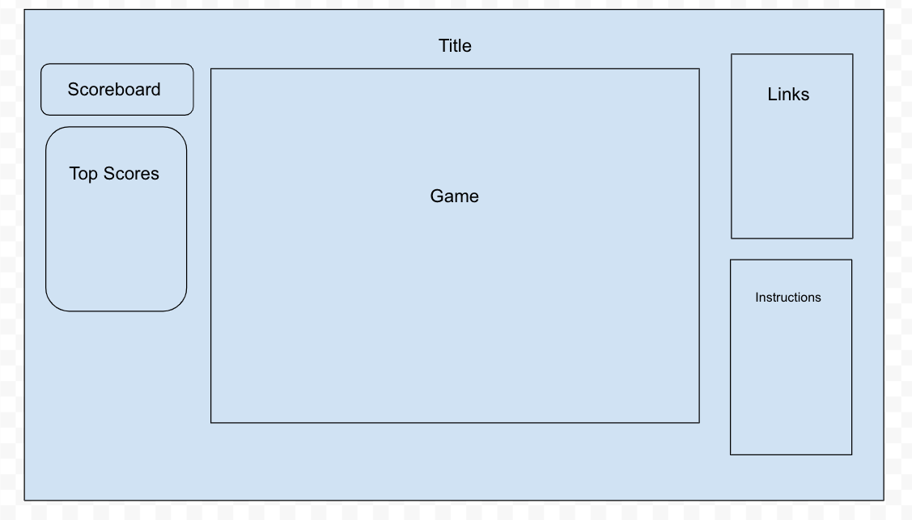

# Treasure-Finder

Treasure Finder is a side-scroller where you catch as much coins as you can.

### MVP

The features necessary are:
- Player
- Treasure
- Stages
- Counter
- Scoreboard
- Music

### Technologies, Libraries, APIs

This game will be made with canvas.js, CSS, and most likely vanilla JS and HTML.

### Wireframes

Create Sound Toggle Button right below the game.

### Backend

The backend will only have a database to contain the scores.

### Implementation Timeline

 
